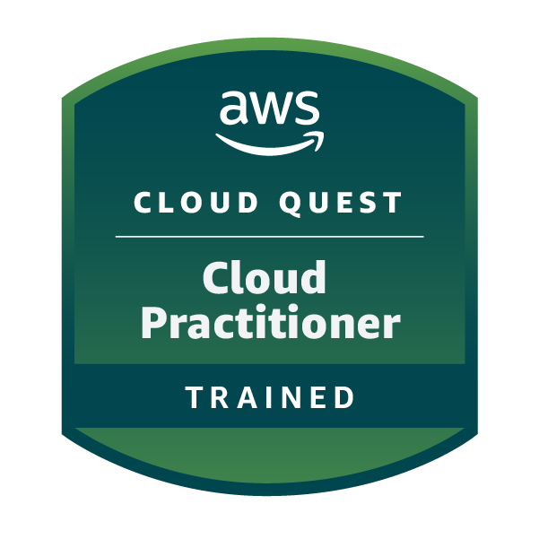
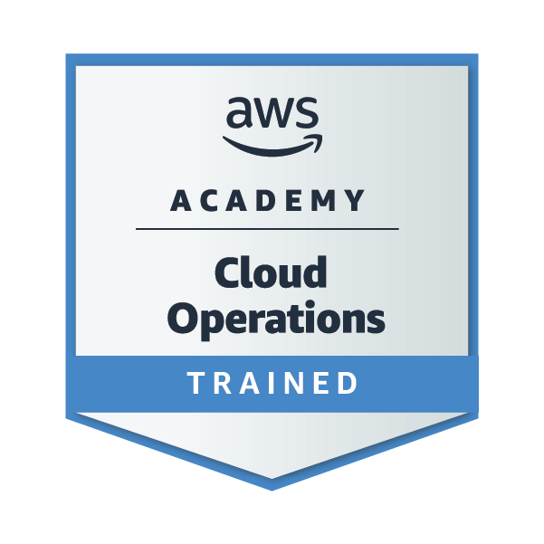
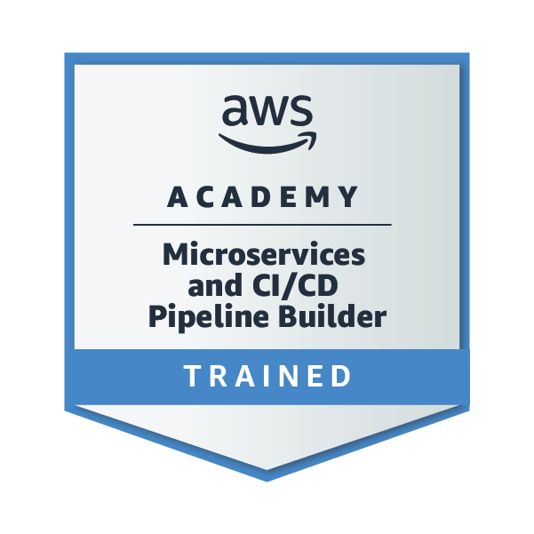

 

 

<table>
  <tr>
    <td align="center"></td>
    <td align="center"></td>
  </tr>
</table>

<h1><i>Hi, </i> I'm JJ!</h1>
<h3><small><i>Building things by day, playing piano by night </i></small></h3>
 

<h2> ꫂ᭪݁.   About Me </h2>
<ul>
<li> Aspiring Software Developer and Engineering Student. </li>
<li> Building backend architectures and cloud infrastructure. </li>
<li> Treasurer of the <i> IEEE </i> student branch (2026 – 2028). </li>
</ul>

<h2> 𖦹.   Technologies </h2>

<table>
  <tr>
    <td></td>
    <td>
<b>Java</b>
</td>
  </tr>
  <tr>
    <td></td>
    <td>
<b>C#</b>
</td>
  </tr>
  <tr>
    <td></td>
    <td>
<b>.NET / ASP.NET</b>
</td>
  </tr>
  <tr>
    <td></td>
    <td>
<b>Spring Boot</b>
</td>
  </tr>
  <tr>
    <td></td>
    <td>
<b>Python</b>
</td>
  </tr>
  <tr>
    <td></td>
    <td>
<b>AWS</b>
</td>
  </tr>
  <tr>
    <td></td>
    <td>
<b>SQL</b>
</td>
  </tr>
  <tr>
    <td></td>
    <td>
<b>Git</b>
</td>
  </tr>
</table>

<h2>✧. Certifications </h2>

  
  
  
  

<h2> Thank you for your interest in my profile. </h2>

